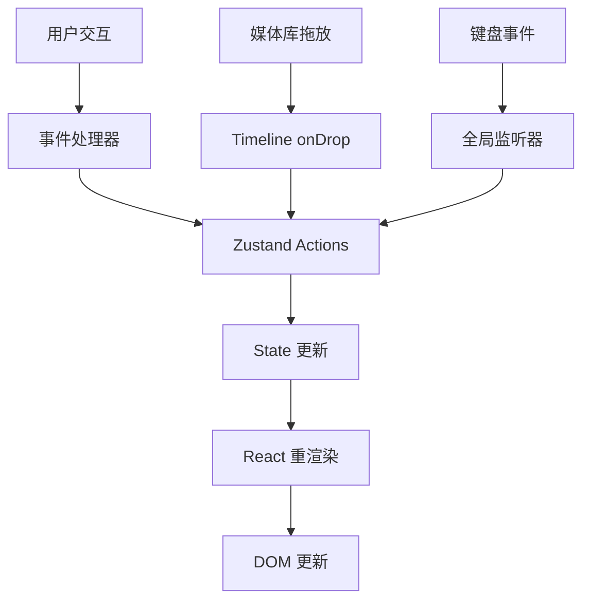

# 设计文档 - 时间轴区域

## 概述

时间轴区域是视频编辑器的核心交互界面，负责管理和显示项目的时间序列结构。本设计采用 React + TypeScript + Zustand 架构，实现高性能的拖放、缩放和实时预览功能。

时间轴由以下核心部分组成：
- **时间标尺（Timescale）**: 显示时间刻度，支持动态缩放
- **轨道列表（Track List）**: 管理多个视频和音频轨道
- **片段（Clips）**: 在轨道上显示的媒体素材实例
- **播放头（Playhead）**: 指示当前时间位置
- **工具栏（Toolbar）**: 提供缩放、吸附等控制功能

设计目标：
1. 流畅的拖放体验（60fps）
2. 精确的时间控制（毫秒级）
3. 可扩展的轨道系统
4. 高效的渲染性能

## 架构

### 组件层次结构

```
Timeline (容器组件)
├── TimelineToolbar (工具栏)
│   ├── ZoomControls (缩放控制)
│   ├── SnapToggle (吸附开关)
│   └── TimeDisplay (时间显示)
├── TimelineHeader (时间标尺区域)
│   ├── Timescale (时间刻度)
│   └── Playhead (播放头 - 顶部部分)
└── TimelineBody (轨道区域)
    ├── TrackList (轨道列表)
    │   ├── VideoTrack[] (视频轨道)
    │   │   └── Clip[] (片段)
    │   └── AudioTrack[] (音频轨道)
    │       └── Clip[] (片段)
    └── Playhead (播放头 - 主体部分)
```

### 状态管理架构

使用 Zustand 管理时间轴状态，分为以下几个 store：

1. **timelineStore**: 核心时间轴状态
   - tracks: 轨道列表
   - clips: 片段列表
   - playheadPosition: 播放头位置
   - zoomLevel: 缩放级别
   - snapEnabled: 吸附功能开关

2. **selectionStore**: 选择状态
   - selectedClipIds: 选中的片段 ID 列表
   - hoveredClipId: 悬停的片段 ID

3. **dragStore**: 拖放状态
   - isDragging: 是否正在拖动
   - dragType: 拖动类型（move | trim-left | trim-right | add）
   - dragData: 拖动数据

### 数据流



## 组件和接口

### 核心数据模型

```typescript
// 轨道类型
type TrackType = 'video' | 'audio';

// 轨道接口
interface Track {
  id: string;
  name: string;
  type: TrackType;
  order: number;  // 显示顺序，数字越大越靠上
  height: number; // 轨道高度（像素）
}

// 片段接口
interface Clip {
  id: string;
  trackId: string;
  mediaId: string;        // 关联的媒体文件 ID
  startTime: number;      // 在时间轴上的开始时间（秒）
  duration: number;       // 片段持续时间（秒）
  trimStart: number;      // 素材的入点（秒）
  trimEnd: number;        // 素材的出点（秒）
  thumbnailUrl?: string;  // 缩略图 URL
}

// 时间轴配置
interface TimelineConfig {
  pixelsPerSecond: number;  // 缩放级别：每秒对应的像素数
  minZoom: number;          // 最小缩放级别（10 px/s）
  maxZoom: number;          // 最大缩放级别（200 px/s）
  snapThreshold: number;    // 吸附阈值（像素）
  trackHeight: number;      // 默认轨道高度
  minClipDuration: number;  // 最小片段持续时间（秒）
}

// 拖动状态
interface DragState {
  isDragging: boolean;
  dragType: 'move' | 'trim-left' | 'trim-right' | 'add' | null;
  clipId?: string;
  startX: number;
  startTime: number;
  originalDuration?: number;
}
```

### Timeline 组件接口

```typescript
interface TimelineProps {
  className?: string;
  style?: React.CSSProperties;
}

// Timeline 组件导出的方法（通过 ref）
interface TimelineRef {
  play: () => void;
  pause: () => void;
  seek: (time: number) => void;
  addTrack: (type: TrackType) => void;
  removeTrack: (trackId: string) => void;
  exportProject: () => TimelineProject;
  importProject: (project: TimelineProject) => void;
}
```

### Clip 组件接口

```typescript
interface ClipProps {
  clip: Clip;
  track: Track;
  zoomLevel: number;
  isSelected: boolean;
  onSelect: (clipId: string, multi: boolean) => void;
  onDragStart: (clipId: string, dragType: DragState['dragType']) => void;
  onDragMove: (deltaX: number) => void;
  onDragEnd: () => void;
}
```

### Timescale 组件接口

```typescript
interface TimescaleProps {
  duration: number;      // 总时长（秒）
  zoomLevel: number;     // 缩放级别（px/s）
  scrollLeft: number;    // 滚动位置
  onSeek: (time: number) => void;
}
```

## 数据模型

### 时间轴项目数据结构

```typescript
interface TimelineProject {
  version: string;
  tracks: Track[];
  clips: Clip[];
  settings: {
    duration: number;
    fps: number;
    resolution: { width: number; height: number };
  };
}
```

### 持久化格式（JSON）

```json
{
  "version": "1.0.0",
  "tracks": [
    {
      "id": "track-1",
      "name": "视频 1",
      "type": "video",
      "order": 2,
      "height": 80
    },
    {
      "id": "track-2",
      "name": "音频 1",
      "type": "audio",
      "order": 1,
      "height": 60
    }
  ],
  "clips": [
    {
      "id": "clip-1",
      "trackId": "track-1",
      "mediaId": "media-123",
      "startTime": 0,
      "duration": 5.5,
      "trimStart": 0,
      "trimEnd": 5.5
    }
  ],
  "settings": {
    "duration": 60,
    "fps": 30,
    "resolution": { "width": 1920, "height": 1080 }
  }
}
```

### Zustand Store 结构

```typescript
interface TimelineStore {
  // 状态
  tracks: Track[];
  clips: Clip[];
  playheadPosition: number;
  zoomLevel: number;
  snapEnabled: boolean;
  selectedClipIds: string[];
  dragState: DragState;
  
  // Actions
  addTrack: (type: TrackType) => void;
  removeTrack: (trackId: string) => void;
  addClip: (clip: Omit<Clip, 'id'>) => void;
  updateClip: (clipId: string, updates: Partial<Clip>) => void;
  removeClip: (clipId: string) => void;
  removeClips: (clipIds: string[]) => void;
  setPlayheadPosition: (position: number) => void;
  setZoomLevel: (level: number) => void;
  toggleSnap: () => void;
  selectClip: (clipId: string, multi: boolean) => void;
  clearSelection: () => void;
  setDragState: (state: Partial<DragState>) => void;
  
  // 计算属性（通过 selector）
  getClipsByTrack: (trackId: string) => Clip[];
  getTotalDuration: () => number;
  getClipAtPosition: (trackId: string, time: number) => Clip | null;
}
```

## 核心算法

### 1. 时间到像素转换

```typescript
// 时间（秒）转换为像素位置
function timeToPixels(time: number, zoomLevel: number): number {
  return time * zoomLevel;
}

// 像素位置转换为时间（秒）
function pixelsToTime(pixels: number, zoomLevel: number): number {
  return pixels / zoomLevel;
}
```

### 2. 吸附计算

```typescript
function calculateSnapPosition(
  targetTime: number,
  clips: Clip[],
  snapThreshold: number,
  zoomLevel: number
): number {
  if (!snapEnabled) return targetTime;
  
  const thresholdTime = snapThreshold / zoomLevel;
  let closestTime = targetTime;
  let minDistance = thresholdTime;
  
  // 检查所有片段的边缘
  for (const clip of clips) {
    const clipStart = clip.startTime;
    const clipEnd = clip.startTime + clip.duration;
    
    // 检查与开始位置的距离
    const distToStart = Math.abs(targetTime - clipStart);
    if (distToStart < minDistance) {
      minDistance = distToStart;
      closestTime = clipStart;
    }
    
    // 检查与结束位置的距离
    const distToEnd = Math.abs(targetTime - clipEnd);
    if (distToEnd < minDistance) {
      minDistance = distToEnd;
      closestTime = clipEnd;
    }
  }
  
  // 检查与播放头的距离
  const distToPlayhead = Math.abs(targetTime - playheadPosition);
  if (distToPlayhead < minDistance) {
    closestTime = playheadPosition;
  }
  
  return closestTime;
}
```

### 3. 片段碰撞检测

```typescript
function checkClipCollision(
  clip: Clip,
  newStartTime: number,
  newDuration: number,
  trackId: string,
  allClips: Clip[]
): boolean {
  const newEndTime = newStartTime + newDuration;
  
  return allClips.some(otherClip => {
    // 跳过自己
    if (otherClip.id === clip.id) return false;
    
    // 只检查同一轨道
    if (otherClip.trackId !== trackId) return false;
    
    const otherStart = otherClip.startTime;
    const otherEnd = otherClip.startTime + otherClip.duration;
    
    // 检查时间范围是否重叠
    return !(newEndTime <= otherStart || newStartTime >= otherEnd);
  });
}
```

### 4. 时间刻度生成

```typescript
function generateTimeMarks(
  duration: number,
  zoomLevel: number,
  viewportWidth: number
): TimeMarker[] {
  // 根据缩放级别确定刻度间隔
  let interval: number;
  if (zoomLevel >= 100) {
    interval = 1; // 1 秒
  } else if (zoomLevel >= 50) {
    interval = 2; // 2 秒
  } else if (zoomLevel >= 20) {
    interval = 5; // 5 秒
  } else {
    interval = 10; // 10 秒
  }
  
  const markers: TimeMarker[] = [];
  for (let time = 0; time <= duration; time += interval) {
    markers.push({
      time,
      position: timeToPixels(time, zoomLevel),
      label: formatTime(time),
      isMajor: time % (interval * 5) === 0
    });
  }
  
  return markers;
}

function formatTime(seconds: number): string {
  const mins = Math.floor(seconds / 60);
  const secs = Math.floor(seconds % 60);
  const ms = Math.floor((seconds % 1) * 1000);
  return `${mins.toString().padStart(2, '0')}:${secs.toString().padStart(2, '0')}.${ms.toString().padStart(3, '0')}`;
}
```

### 5. 拖放处理流程

```typescript
// 从媒体库拖放素材到时间轴
function handleDropFromMediaLibrary(
  e: React.DragEvent,
  trackId: string,
  dropX: number
) {
  const mediaData = JSON.parse(e.dataTransfer.getData('application/json'));
  const track = tracks.find(t => t.id === trackId);
  
  if (!track) return;
  
  // 验证素材类型与轨道类型匹配
  if (track.type === 'video' && mediaData.type === 'audio') return;
  if (track.type === 'audio' && mediaData.type === 'video') return;
  
  // 计算放置时间
  const scrollLeft = timelineRef.current?.scrollLeft || 0;
  const dropTime = pixelsToTime(dropX + scrollLeft, zoomLevel);
  
  // 应用吸附
  const snappedTime = calculateSnapPosition(dropTime, clips, snapThreshold, zoomLevel);
  
  // 获取素材持续时间
  let duration = mediaData.duration || 5; // 图片默认 5 秒
  
  // 检查碰撞
  const hasCollision = checkClipCollision(
    { id: '', trackId, startTime: snappedTime, duration } as Clip,
    snappedTime,
    duration,
    trackId,
    clips
  );
  
  if (hasCollision) {
    // 显示错误提示
    return;
  }
  
  // 创建新片段
  addClip({
    trackId,
    mediaId: mediaData.id,
    startTime: snappedTime,
    duration,
    trimStart: 0,
    trimEnd: duration,
    thumbnailUrl: mediaData.url
  });
}
```

## 正确性属性

*属性是一个特征或行为，应该在系统的所有有效执行中保持为真——本质上是关于系统应该做什么的形式化陈述。属性作为人类可读规范和机器可验证正确性保证之间的桥梁。*


### 属性 1: 素材拖放创建片段
*对于任意*素材和目标位置，当从媒体库拖放到轨道时，应该在目标位置创建新的片段
**验证需求: 2.1**

### 属性 2: 素材类型与轨道类型匹配
*对于任意*素材，只有当素材类型与目标轨道类型兼容时（视频/图片→视频轨道，音频→音频轨道），才能成功放置
**验证需求: 2.2, 2.3, 2.4**

### 属性 3: 片段显示素材信息
*对于任意*放置的片段，应该显示对应素材的缩略图和名称
**验证需求: 2.5**

### 属性 4: 片段移动更新时间
*对于任意*片段，拖动到新位置后，其开始时间应该更新为新位置对应的时间值
**验证需求: 3.2**

### 属性 5: 片段跨轨道移动
*对于任意*片段，拖动到不同轨道时，其 trackId 应该更新为目标轨道的 ID
**验证需求: 3.3**

### 属性 6: 吸附功能对齐
*对于任意*片段移动操作，当吸附功能启用且距离相邻片段边缘小于阈值时，片段应该自动对齐到该边缘
**验证需求: 3.4**

### 属性 7: 片段无重叠约束
*对于任意*片段放置或移动操作，同一轨道上的片段时间范围不应该重叠
**验证需求: 3.6**

### 属性 8: 裁剪调整片段属性
*对于任意*片段裁剪操作，拖动左边缘应该调整开始时间和持续时间，拖动右边缘应该只调整持续时间
**验证需求: 4.2, 4.3**

### 属性 9: 裁剪边界约束
*对于任意*片段裁剪操作，裁剪后的入点和出点不应该超出素材的原始持续时间范围
**验证需求: 4.4**

### 属性 10: 最小持续时间约束
*对于任意*片段裁剪操作，裁剪后的持续时间不应该小于 0.1 秒
**验证需求: 4.5**

### 属性 11: 播放头点击定位
*对于任意*时间标尺上的点击位置，播放头应该移动到该位置对应的时间
**验证需求: 5.2**

### 属性 12: 时间格式化一致性
*对于任意*时间值，显示格式应该为 MM:SS.mmm（分钟:秒.毫秒）
**验证需求: 5.4, 10.2**

### 属性 13: 播放头自动滚动
*对于任意*播放头位置，当其超出可见范围时，时间轴应该自动滚动以保持播放头可见
**验证需求: 5.5**

### 属性 14: 缩放调整级别
*对于任意*鼠标滚轮滚动操作，缩放级别应该在 10-200 像素/秒范围内调整
**验证需求: 6.1, 6.5**

### 属性 15: 刻度密度随缩放变化
*对于任意*缩放级别，时间刻度的间隔应该根据缩放级别动态调整（放大时更密集，缩小时更稀疏）
**验证需求: 6.2, 6.3**

### 属性 16: 缩放保持播放头中心
*对于任意*缩放操作，播放头应该保持在视口中心位置
**验证需求: 6.4**

### 属性 17: 片段宽度随缩放比例变化
*对于任意*片段和缩放级别，片段的视觉宽度应该等于 (持续时间 × 缩放级别) 像素
**验证需求: 6.6**

### 属性 18: 删除键移除选中片段
*对于任意*选中的片段集合，按下 Delete 或 Backspace 键后，这些片段应该从时间轴中移除
**验证需求: 7.2, 7.5**

### 属性 19: 多选功能
*对于任意*片段序列，按住 Ctrl/Cmd 依次点击应该将它们全部添加到选中集合
**验证需求: 7.3**

### 属性 20: 点击空白取消选择
*对于任意*选中状态，点击时间轴空白区域后，选中集合应该清空
**验证需求: 7.4**

### 属性 21: 滚动方向控制
*对于任意*鼠标滚轮操作，不按修饰键时应该垂直滚动，按住 Shift 时应该水平滚动
**验证需求: 8.4, 8.5**

### 属性 22: 添加轨道功能
*对于任意*轨道类型（视频或音频），点击对应的添加按钮后，应该在相应区域创建新轨道
**验证需求: 9.1, 9.2**

### 属性 23: 删除轨道及其片段
*对于任意*轨道，删除操作应该同时移除该轨道及其包含的所有片段
**验证需求: 9.3**

### 属性 24: 空轨道可删除
*对于任意*不包含片段的轨道，应该允许删除操作
**验证需求: 9.5**

### 属性 25: 片段宽度条件显示
*对于任意*片段，当其视觉宽度大于 60 像素时应该显示持续时间文本，小于等于 60 像素时只显示缩略图
**验证需求: 10.1, 10.6**

### 属性 26: 吸附状态禁用时自由移动
*对于任意*片段移动操作，当吸附功能禁用时，片段应该可以移动到任意位置而不受吸附影响
**验证需求: 11.3**

### 属性 27: 吸附状态持久化往返
*对于任意*吸附状态设置，保存到本地存储后重新加载，应该恢复相同的状态
**验证需求: 11.5, 11.6**

### 属性 28: 操作自动保存
*对于任意*添加、移动或删除片段的操作，变更应该自动保存到项目数据
**验证需求: 12.1, 12.6**

### 属性 29: 项目数据序列化往返
*对于任意*时间轴状态，序列化为 JSON 后再反序列化，应该得到等价的时间轴状态（包含相同的轨道和片段）
**验证需求: 12.2, 12.3**

### 属性 30: 片段属性完整性
*对于任意*片段，序列化后的数据应该包含素材 ID、轨道 ID、开始时间、持续时间、入点、出点等所有必需属性
**验证需求: 12.4**

### 属性 31: 序列化错误处理
*对于任意*序列化或反序列化失败的情况，应该显示错误提示并保持当前状态不变
**验证需求: 12.5**

## 错误处理

### 错误类型和处理策略

1. **素材类型不匹配错误**
   - 场景: 尝试将音频素材拖放到视频轨道
   - 处理: 阻止放置操作，显示提示"音频素材只能放置到音频轨道"
   - 恢复: 无需恢复，保持当前状态

2. **片段重叠错误**
   - 场景: 移动或放置片段导致与现有片段重叠
   - 处理: 阻止操作，显示提示"片段位置冲突"
   - 恢复: 片段返回原位置或取消放置

3. **裁剪超出边界错误**
   - 场景: 裁剪操作超出素材原始时长
   - 处理: 限制裁剪范围到素材边界
   - 恢复: 自动调整到最大允许值

4. **最小持续时间错误**
   - 场景: 裁剪导致片段持续时间小于 0.1 秒
   - 处理: 阻止裁剪，保持最小持续时间
   - 恢复: 无需恢复

5. **序列化失败错误**
   - 场景: 保存项目数据时 JSON 序列化失败
   - 处理: 显示错误提示"保存失败，请重试"
   - 恢复: 保持当前内存状态，允许用户重试

6. **反序列化失败错误**
   - 场景: 加载项目数据时 JSON 解析失败或数据格式不正确
   - 处理: 显示错误提示"项目文件损坏"
   - 恢复: 加载空白项目或上次成功的备份

7. **缩放范围错误**
   - 场景: 缩放级别超出 10-200 px/s 范围
   - 处理: 限制到边界值
   - 恢复: 自动调整到最近的有效值

8. **播放头越界错误**
   - 场景: 播放头位置超出项目总时长
   - 处理: 限制到 [0, totalDuration] 范围
   - 恢复: 自动调整到边界值

### 错误边界组件

```typescript
class TimelineErrorBoundary extends React.Component<
  { children: React.ReactNode },
  { hasError: boolean; error: Error | null }
> {
  state = { hasError: false, error: null };

  static getDerivedStateFromError(error: Error) {
    return { hasError: true, error };
  }

  componentDidCatch(error: Error, errorInfo: React.ErrorInfo) {
    console.error('Timeline Error:', error, errorInfo);
    // 可以发送到错误追踪服务
  }

  render() {
    if (this.state.hasError) {
      return (
        <div className="flex items-center justify-center h-full bg-gray-900 text-white">
          <div className="text-center">
            <h2 className="text-xl mb-4">时间轴加载失败</h2>
            <p className="text-gray-400 mb-4">{this.state.error?.message}</p>
            <button
              onClick={() => this.setState({ hasError: false, error: null })}
              className="px-4 py-2 bg-blue-600 rounded hover:bg-blue-700"
            >
              重新加载
            </button>
          </div>
        </div>
      );
    }

    return this.props.children;
  }
}
```

## 测试策略

### 双重测试方法

时间轴功能将采用单元测试和基于属性的测试相结合的方法，以确保全面覆盖：

- **单元测试**: 验证特定示例、边缘情况和错误条件
- **基于属性的测试**: 验证所有输入的通用属性

两者是互补的，共同提供全面的覆盖（单元测试捕获具体错误，属性测试验证通用正确性）。

### 单元测试重点

单元测试应该专注于：
- 特定的示例场景（如初始化状态、特定的拖放操作）
- 组件之间的集成点（如 Timeline 与 Store 的交互）
- 边缘情况和错误条件（如空轨道、超出边界的操作）

避免编写过多的单元测试 - 基于属性的测试会处理大量输入的覆盖。

### 基于属性的测试配置

**测试库选择**: 使用 `fast-check` 库进行基于属性的测试（TypeScript/JavaScript 生态系统的标准选择）

**测试配置**:
- 每个属性测试最少运行 100 次迭代（由于随机化）
- 每个测试必须引用其设计文档属性
- 标签格式: `Feature: timeline-area, Property {number}: {property_text}`
- 每个正确性属性必须由单个基于属性的测试实现

**示例属性测试**:

```typescript
import fc from 'fast-check';
import { describe, it, expect } from 'vitest';

describe('Timeline Properties', () => {
  // Feature: timeline-area, Property 7: 片段无重叠约束
  it('should prevent clip overlap on the same track', () => {
    fc.assert(
      fc.property(
        fc.record({
          trackId: fc.string(),
          clips: fc.array(fc.record({
            id: fc.string(),
            startTime: fc.float({ min: 0, max: 100 }),
            duration: fc.float({ min: 0.1, max: 10 })
          }))
        }),
        ({ trackId, clips }) => {
          // 在轨道上放置所有片段
          const timeline = new Timeline();
          clips.forEach(clip => {
            timeline.addClip({ ...clip, trackId });
          });
          
          // 验证同一轨道上没有重叠
          const trackClips = timeline.getClipsByTrack(trackId);
          for (let i = 0; i < trackClips.length; i++) {
            for (let j = i + 1; j < trackClips.length; j++) {
              const clip1 = trackClips[i];
              const clip2 = trackClips[j];
              const end1 = clip1.startTime + clip1.duration;
              const end2 = clip2.startTime + clip2.duration;
              
              // 验证不重叠
              expect(
                end1 <= clip2.startTime || end2 <= clip1.startTime
              ).toBe(true);
            }
          }
        }
      ),
      { numRuns: 100 }
    );
  });

  // Feature: timeline-area, Property 29: 项目数据序列化往返
  it('should preserve timeline state through serialization round-trip', () => {
    fc.assert(
      fc.property(
        fc.record({
          tracks: fc.array(fc.record({
            id: fc.string(),
            name: fc.string(),
            type: fc.constantFrom('video', 'audio'),
            order: fc.integer({ min: 0, max: 10 }),
            height: fc.integer({ min: 60, max: 120 })
          })),
          clips: fc.array(fc.record({
            id: fc.string(),
            trackId: fc.string(),
            mediaId: fc.string(),
            startTime: fc.float({ min: 0, max: 100 }),
            duration: fc.float({ min: 0.1, max: 10 }),
            trimStart: fc.float({ min: 0, max: 10 }),
            trimEnd: fc.float({ min: 0, max: 10 })
          }))
        }),
        (timelineState) => {
          // 序列化
          const json = JSON.stringify(timelineState);
          
          // 反序列化
          const restored = JSON.parse(json);
          
          // 验证等价性
          expect(restored).toEqual(timelineState);
        }
      ),
      { numRuns: 100 }
    );
  });
});
```

### 测试覆盖目标

- 所有 31 个正确性属性都有对应的基于属性的测试
- 核心功能的单元测试覆盖率 > 80%
- 边缘情况和错误处理的单元测试覆盖
- 集成测试覆盖主要用户流程

### 性能测试

除了功能测试，还需要进行性能测试：

1. **渲染性能**: 测试包含 100+ 片段的时间轴渲染时间
2. **拖放性能**: 测试拖放操作的帧率（目标 60fps）
3. **缩放性能**: 测试缩放操作的响应时间
4. **滚动性能**: 测试大型项目的滚动流畅度

这些性能测试不在基于属性的测试范围内，应该作为独立的性能基准测试。
